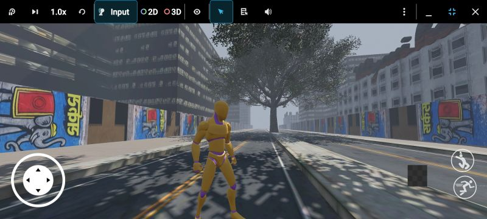
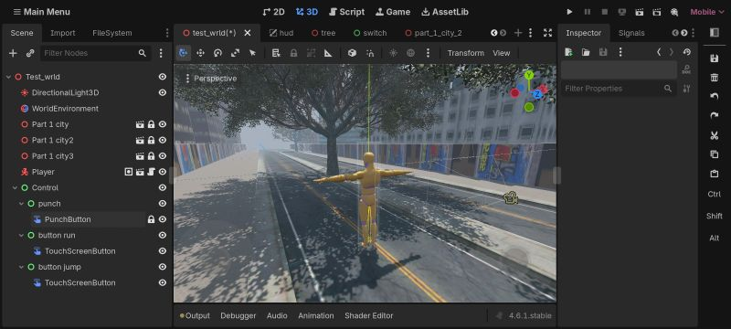
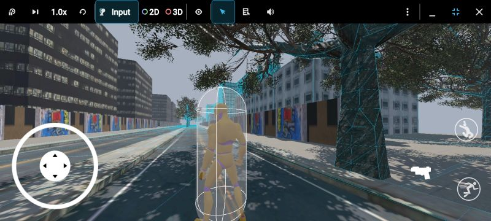
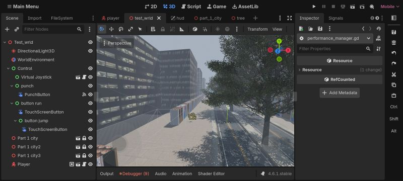
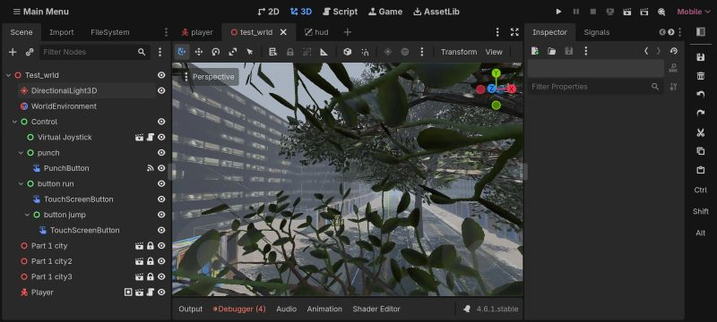

<div align="center">

# GTS

### An Open World Third Person Action Game — Built for Android




</div>

<br>

A city built from nothing. A character built from nothing. A control scheme rebuilt entirely for touch. GTS is a one-developer attempt to bring a full third-person open world action experience to mobile, without cutting corners on how it looks, moves, or feels.

<br>

## What This Project Actually Is

GTS is not a tutorial project. It is a ground-up open world action game, engineered specifically for Android, where every core system — movement, camera, combat, input, performance — was built and tuned by hand rather than pulled from a template.

<br>

<table>
<tr>
<td width="50%" valign="top">

### The City

A multi-zone urban environment stitched together from modular street blocks, layered with dynamic lighting and live shadow casting. The world is not one giant scene — it is split into independently loaded zones, built to scale as the game grows.

</td>
<td width="50%" valign="top">



</td>
</tr>
</table>

<br>

<table>
<tr>
<td width="50%" valign="top">



</td>
<td width="50%" valign="top">

### The Character

A fully rigged skeleton driving a layered animation pipeline through AnimationPlayer and AnimationMixer. Locomotion, jump, run, and combat reactions like Hit Head blend into each other instead of snapping — built to feel like a real character, not a placeholder.

</td>
</tr>
</table>

<br>

<table>
<tr>
<td width="50%" valign="top">

### Touch, Rebuilt From Zero

No ported keyboard scheme. The entire control layer was designed for fingers — a virtual joystick for movement and dedicated touch buttons for run, jump, and combat, tuned for responsiveness across different screen sizes.

</td>
<td width="50%" valign="top">



</td>
</tr>
</table>

<br>

<table>
<tr>
<td width="50%" valign="top">



</td>
<td width="50%" valign="top">

### Camera, HUD, and the Map

A SpringArm3D camera keeps the action framed and collision-aware at all times. The HUD layers a live minimap on top of gameplay so the player always knows where they stand in the city.

</td>
</tr>
</table>

<br>

## Under the Hood

| System | Built With |
|---|---|
| Engine | Godot Engine 4.6.1 |
| Scripting | GDScript |
| Rendering | Forward+ Mobile Pipeline |
| Animation | AnimationPlayer + AnimationMixer |
| Camera | SpringArm3D Third Person Rig |
| Input | Custom Virtual Joystick + TouchScreenButton |
| Physics | CollisionShape3D |
| Optimization | Custom Performance Manager |

<br>

## How It's Structured

The project is built scene-first, not script-first. The player is a self-contained unit — rig, collider, camera, and animation controller all packed into one reusable scene. The city is split into independent zone scenes pulled together by a central control layer, so new districts can be added without touching existing ones. UI lives entirely outside the world logic, which keeps the HUD and controls portable across every scene in the game.

<br>

## What's Coming

```
[ ] Combat system and enemy AI
[ ] Mission structure and story progression
[ ] New city zones and landmarks
[ ] Expanded combat animation set
[ ] Save and progression system
```

<br>

<div align="center">

## Built By

**Paras Sharma**
Zerox Team

<sub>GTS is in active development — this README will evolve with the project.</sub>

</div>
